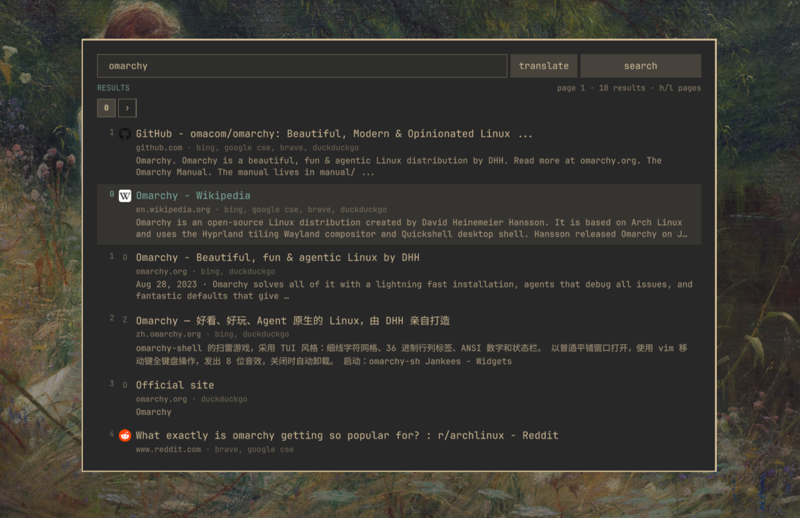

# omaseek

A web search and AI panel for [Omarchy](https://omarchy.org) 4, driven with vim
keys. It searches through a [SearXNG](https://github.com/searxng/searxng) instance you run yourself and asks an agent
CLI you already have — no API keys, no accounts.

**SUPER + d** summons it. **Tab** switches between searching and asking.



https://github.com/user-attachments/assets/32309219-5fd9-43a7-801b-6d99b5b26ce2

## Install

```bash
omarchy plugin add https://github.com/gold-chen-five/omaseek.git --enable
```

Not in the Omarchy plugin marketplace yet, hence the repository URL. Plugins run
unsandboxed inside `omarchy-shell`, so read the code before enabling it.

**Opening it.** Right after install the panel opens by itself on a welcome
page that sets up the two things omaseek needs — SearXNG, and a key to open it
(`SUPER + d`, or **Change key** for another) — each with a button that runs it
in a terminal you can watch; the panel comes back when you close that terminal.
It keeps opening there, with the finished steps ticked, until you choose
**Start searching**.
Meanwhile a magnifier icon just left of the bar's clock opens it. If it is
somewhere else on the bar, `omarchy bar move omaseek --before omarchy.clock`
moves it there. If it is not on the bar at all — the plugin was enabled before
as something other than a bar widget — `omarchy plugin disable omaseek` then
`omarchy plugin enable omaseek --before omarchy.clock` puts it back.

**The keybind.** A plugin cannot bind a key on install, so the welcome page, or
Settings (`ctrl+s`) → Keys → **Open omaseek with**, adds one: `SUPER + d`, or
any key you type there (`super+shift+s`). A terminal shows the line below,
asks, backs up `~/.config/hypr/bindings.lua`, appends it and reloads Hyprland.
A key something else already holds is refused, and a key you bound yourself is
never replaced; the line omaseek added can be changed to another key the same
way. Or add the line yourself:

```lua
o.bind("SUPER + d", "Search", "omarchy-shell shell toggle omaseek")
```

**SearXNG.** Searching needs one. The panel offers to create it the first time
you search, or run `bin/searxng-up`: it starts the `searxng/searxng` container
image on `127.0.0.1:8888` — with rootless Podman when it is installed, so
nothing runs as root, and with Docker otherwise and writes `~/.config/searxng/settings.yml` with the
JSON API on. The image is pinned by digest to a build reviewed with this
release, so no moving tag decides what runs. SearXNG is a rolling release, so
Settings → **Update SearXNG** shows the newest build and its digest, and
switches to exactly that one only when you say yes. To move an existing Docker
instance to Podman, or back: `bin/searxng-up --use podman` (or `--use docker`).

**Asking** uses whichever agent CLI you have — `claude`, `codex`, `crush`,
`opencode`, `gemini`, `hermes`, `copilot`, `cursor-agent`.

## Keys

| key | does |
|---|---|
| `super+d` | summon or dismiss |
| `tab` | search ⇄ ask |
| `shift+tab` | switch to the next agent; the conversation goes with it |
| `enter` | search, or ask |
| `j` `k` | through the results; `enter` opens one |
| `h` `l` | previous and next page; `3h` `5l` walk several, `5gp` jumps to page 5 |
| `y` `Y` | copy a result's URL, or its title with it |
| `v` `V` then `y` | select in an answer and copy |
| `ctrl+shift+c`, `ctrl+v` | copy and paste, as in the agents' terminals (`ctrl+shift+v` pastes too) |
| `/` `?` `n` `N` | search the results or the answer |
| `ga` `gA` | hand off to the agent in a terminal: this result, or everything |
| `gd` `gj` `gs` | ask the AI about a result or a selected passage now, put it in the ask bar unsent, or search for a selection |
| `gt` `gT` | translate the selection, or the whole bar (`ctrl+t` while typing), into a panel on the right; `ctrl+x` closes it |
| `ctrl+c` `ctrl+n` `ctrl+x` | a new conversation, the next saved one, forget this one — in search, `ctrl+c` clears the results |
| `L` `H` | in ask mode: the next saved conversation, or the one before |
| `ctrl+s` | settings |
| `esc` | back, then out |

The field is vim on one line — motions, operators, counts, text objects
(`diw`, `ci"`, `da(`), and `jk` to leave insert. `↑` — or `U` in normal
mode — brings back what you searched or asked before. Paste an address and
`enter` opens it.

Typing a search opens a list under the bar, as Google's does: your past
searches that begin with what you typed, then suggestions from your SearXNG
(`you` → youtube, youtube music, …). `↓` `↑` — or `ctrl+n` `ctrl+p` — put one
in the bar and `enter` searches it; a click does both.

Under the status line, numbered squares are the pages you have read: click one
to go back, or `›` to fetch the next. Ask mode gets the same strip for its last
ten conversations, which survive a restart.

[**KEYS.md**](KEYS.md) has every binding, and settings can move any of them.

## Settings

`ctrl+s`, saved as you go to `~/.config/omaseek/config.json`.

- **Search** — start or stop SearXNG, update its image, language and region,
  results per page, and where suggestions come from (DuckDuckGo, Google, Brave,
  Qwant, Wikipedia — or off).
- **Ask** — the agent, its model and reasoning effort, streaming, and where a
  hand-off opens. Effort goes on the command line of each agent omaseek starts,
  so an agent you already have open keeps its own.
- **Translate** — the language translations go into (the search language by
  default, else 繁體中文), and the agent, model and effort that translate them.
- **Display** — line numbers and page numbers, relative or absolute.
- **Keys** — every binding.
- **Engines** — which engines SearXNG asks: Google CSE, Bing, Brave and
  DuckDuckGo by default, plus Google, Startpage, Yep, Yandex and Yahoo.
  **Search speed** times one real search; **Test engines** asks each one alone
  and says what it gave, or why it refused.

## Update

```bash
omarchy plugin update omaseek
omarchy-restart-shell     # a loaded panel keeps its old code until then
```

## Uninstall

```bash
omarchy plugin remove omaseek
```

A terminal opens and asks whether to take out the `SUPER + d` line omaseek
added, and whether the SearXNG container and image should go too. A binding you
wrote yourself is left alone. `bin/uninstall` does the same from a terminal you
already have open.

Left for you to delete: `~/.config/omaseek`, `~/.local/share/omaseek`,
`~/.cache/omaseek` and `~/.config/searxng`.

## Requirements, and what it touches

| needs | for |
|---|---|
| Omarchy 4 (`omarchy-shell`, `gum`, `jq`, `xdg-terminal-exec`) | the panel, and terminals for setup and removal |
| `python3`, standard library only | `bin/search` and `bin/ask` |
| Podman (recommended, rootless) or Docker | the SearXNG container |
| an agent CLI, optional | asking |
| `tmux` or `herdr`, optional | hand-offs somewhere other than a terminal |

- **sudo** — never with Podman. With Docker, `bin/searxng-up` alone, always in
  a terminal you can watch: `systemctl enable --now docker` when the daemon is
  down, and `sudo docker` when you are not in the `docker` group. Podman
  enables your user's `podman-restart.service`, so SearXNG comes back at login.
- **Network** — your SearXNG and the engines you enable; while you type a
  search, what is typed so far goes through your SearXNG to the suggestion
  source chosen in Settings (never a question, and nothing when it is off);
  DuckDuckGo's favicon
  service, sent each result's bare domain and never your query; Docker Hub, for
  whether a newer SearXNG image exists and, when you update, its digest; your
  agent CLI's own provider. No
  telemetry.
- **Files** — `~/.config/omaseek`, `~/.local/share/omaseek`, `~/.cache/omaseek`,
  `~/.config/searxng`, `~/.local/state/omaseek/searxng-image` and
  `searxng-engine` (the SearXNG build you chose in Update, and Podman or Docker), and removal scripts under `$XDG_RUNTIME_DIR`. Your
  Hyprland config is touched only when you ask — Settings → Keys → Add,
  `bin/install`, or yes at removal — always through `bin/keybind`, one line,
  with a backup.
- **Hand-offs** open the agent's interactive CLI with the same auto-approve
  flags `omarchy-agent` uses. The prompt waits there as an editable draft;
  nothing is submitted for you.

## License

MIT
